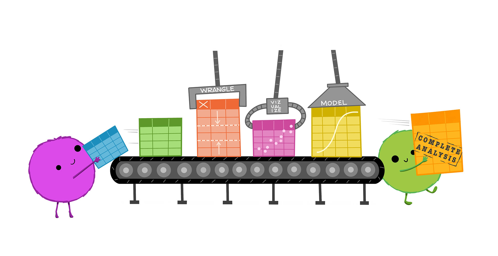

# Introduction to the Tidyverse

## What is the tidyverse?

The [tidyverse](https://www.tidyverse.org/) is self-described as 'an opinionated collection of R packages designed for data science. All packages share an underlying design philosophy, grammar, and data structures'. When you install the `tidyverse` package, you install a suite of 9 tidy-related packages, all of which are designed to help you work with data, from cleaning and manipulation to plotting and modelling. 

```{r echo=FALSE, out.width = "60%", fig.align='center',  fig.cap = 'Artwork by @allison_horst'}

```

They are increasingly popular, have large user bases, and are generally very well-documented. You can install the core set of tidyverse packages with the `install.packages()` function:

```{r, eval = F}
install.packages('tidyverse')
```

Once you install the package, read it into your library for our session today (note: you only have to install packages once, but you must load the packages you are using into your library for ever R 'session').

```{r}
library(tidyverse)
```
