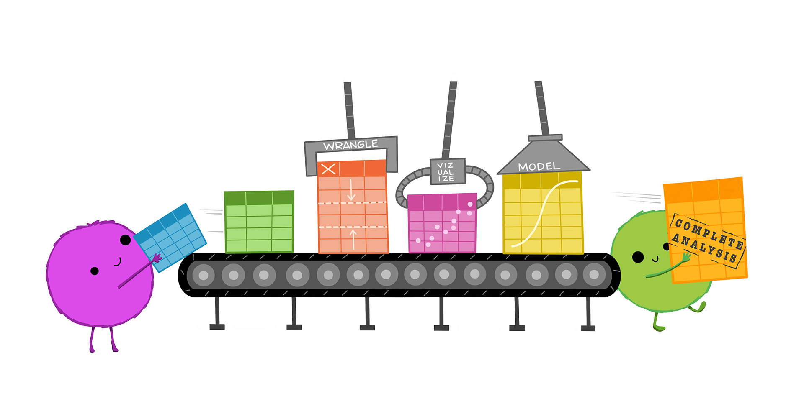

# Introduction to the Tidyverse

## What is the tidyverse?

The [tidyverse](https://www.tidyverse.org/) is self-described as 'an opinionated collection of R packages designed for data science. All packages share an underlying design philosophy, grammar, and data structures'. When you install the `tidyverse` package, you install a suite of 9 tidy-related packages, all of which are designed to help you work with data, from cleaning and manipulation to plotting and modelling. They are increasingly popular, have large user bases, and are generally very well-documented. 

<div class="figure" style="text-align: center">

<p class="caption">(\#fig:unnamed-chunk-1)Artwork by @allison_horst</p>
</div>

## Installing and loading in  

You can install the core set of tidyverse packages with the `install.packages()` function:


```r
install.packages('tidyverse')
```

Once you install the package, read it into your library for our session today (note: you only have to install packages once, but you must load the packages you are using into your library for ever R 'session').


```r
library(tidyverse)
```

```
## ── Attaching packages ─────────────────────────────────────── tidyverse 1.3.2 ──
## ✔ ggplot2 3.4.2      ✔ purrr   0.3.4 
## ✔ tibble  3.1.8      ✔ dplyr   1.0.10
## ✔ tidyr   1.2.1      ✔ stringr 1.4.1 
## ✔ readr   2.1.2      ✔ forcats 0.5.2 
## ── Conflicts ────────────────────────────────────────── tidyverse_conflicts() ──
## ✖ dplyr::filter() masks stats::filter()
## ✖ dplyr::lag()    masks stats::lag()
```
