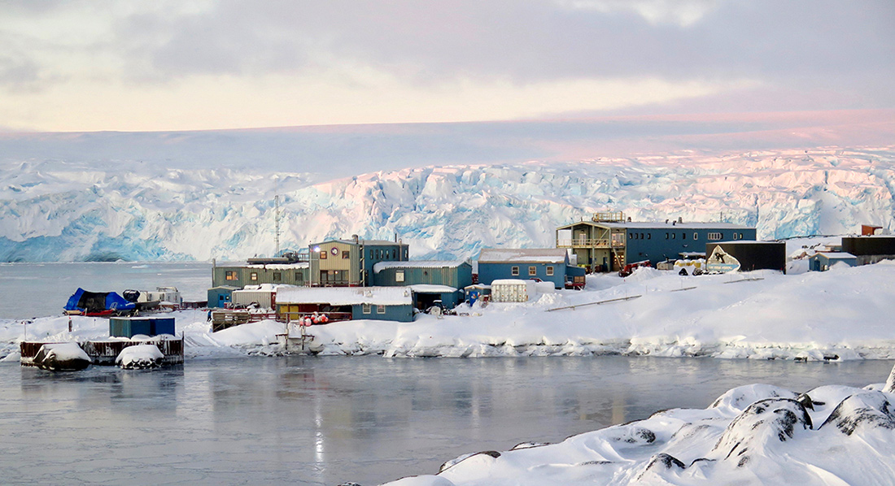
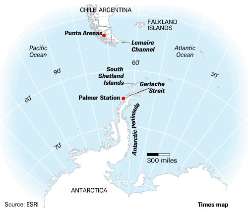

# Data 

## Palmer Station penguins

The Palmer penguins data^[Horst AM, Hill AP, Gorman KB (2020). palmerpenguins: Palmer Archipelago (Antarctica) penguin data. R package version 0.1.0. https://allisonhorst.github.io/palmerpenguins/. doi: 10.5281/zenodo.3960218.] is a relatively new dataset from Horst, Hill, and Gorman (2020).

The data includes: 'Size measurements, clutch observations, and blood isotope ratios for adult foraging Adélie, Chinstrap, and Gentoo penguins observed on islands in the Palmer Archipelago near Palmer Station, Antarctica. Data were collected and made available by Dr. Kristen Gorman and the Palmer Station Long Term Ecological Research (LTER) Program.'

You can read more about the package [here](https://allisonhorst.github.io/palmerpenguins/index.html).

```{r, eval = F}
install.packages('palmerpenguins')
# or
remotes::install_github("allisonhorst/palmerpenguins")
```

```{r}
library(palmerpenguins)
```

Learn more about each variable in the documentation
```{r}
?penguins_raw
```

Let's take a look at its structure

```{r}
penguins <- penguins_raw
str(penguins)
```


## Palmer Station weather 

We're going to want to work an additional data set relevant to the penguins data:

```{r}
weather <- read.csv("https://pasta.lternet.edu/package/data/eml/knb-lter-pal/28/8/375b34051b162d84516ec2d02f864675") 
```

These data are als available thrugh the Environmental Data Initiative Long Term Ecological Research program at Palmer Station. Read more [here](https://portal.edirepository.org/nis/mapbrowse?packageid=knb-lter-pal.28.8)

Palmer Station is...

```{r echo=FALSE, out.width = "50%", caption = c('Palmer station West Pier (credit: Ken Keenan USAP)','Map of Palmer Station location')}


```


```{r}
str(weather)
```

## Why Palmer data?

Documented

Data sets can be notoriously problematic

Iris...

Pima Indians...


